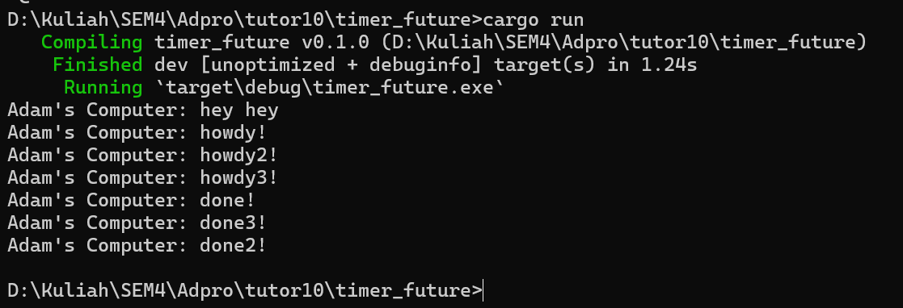
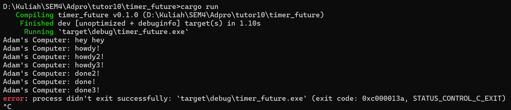

# Module 10 tutorial

1. Experiment 1.2: Understanding how it works.

 Since the code to print "Adam's Computer: hey hey" are outside of the asynchronous task, then it will printed first. After that the main code will run the asynchronous task and after printing the "Adam's Computer: howdy!" the program wait for 2 seconds because of `TimerFuture` set to wait for 2 seconds after that print the "Adam's Computer: done!"

2. Experiment 1.3: Multiple Spawn and removing drop
    With drop
    

    No drop
    
    So the function of `drop(spawner);` is to drop the spawner and it will not run the task anymore. So, the program will not wait for the task to finish and will print "Adam's Computer: done!" immediately.